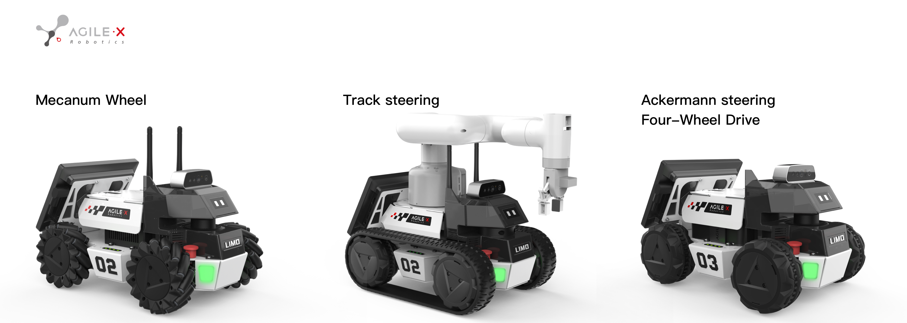
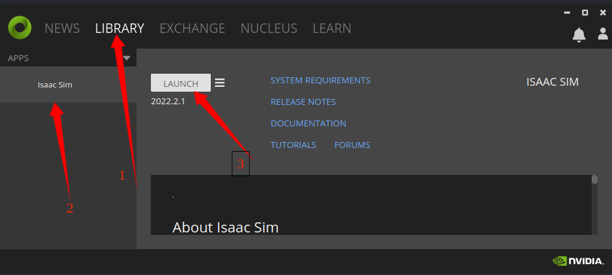
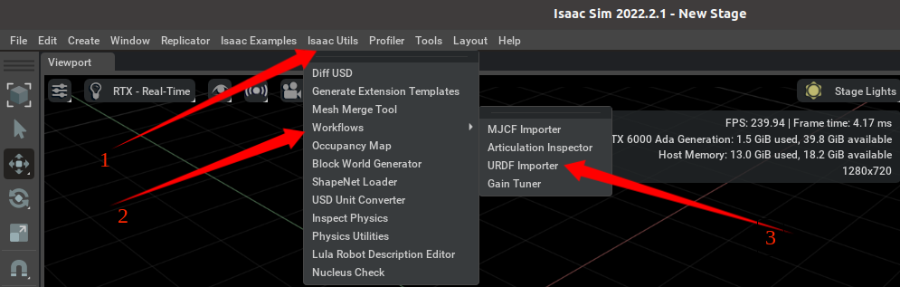
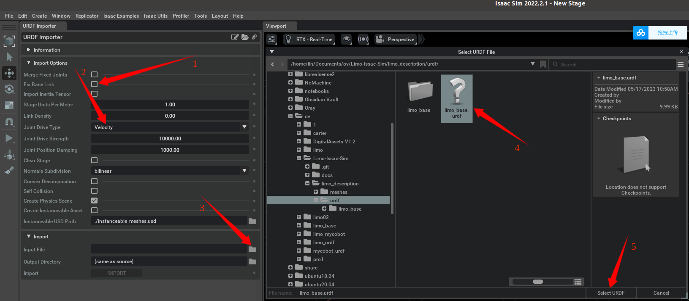
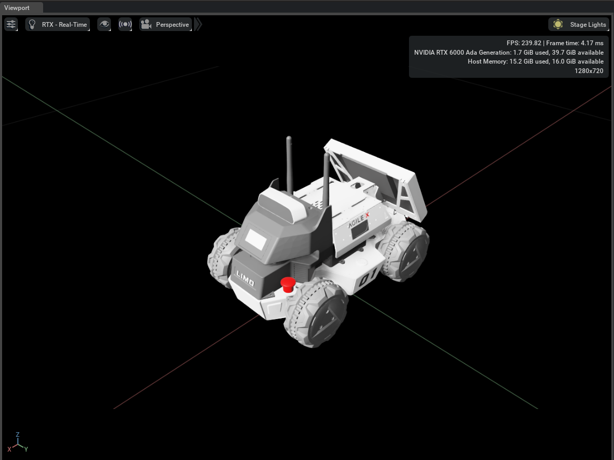
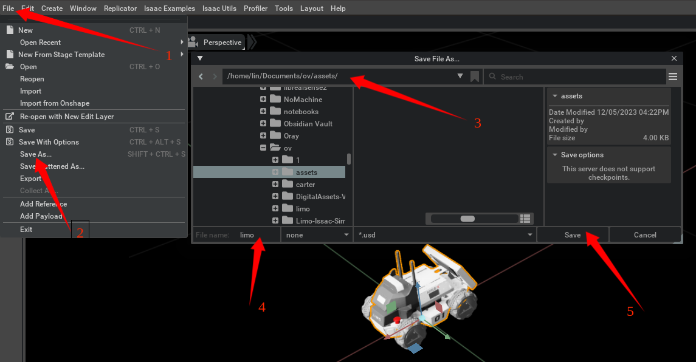
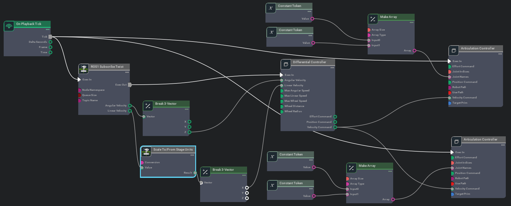
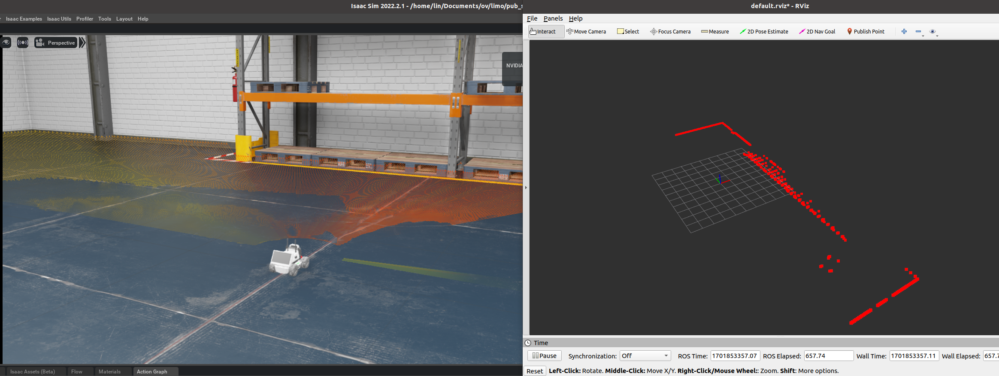

# Limo Isaac-SIM Simulation Operation Process

  

## 1 Env 

**ubuntu20.04、Omniverse Launcher-1.9.8、Isaac-Sim-(2022.2.1 & 2023.1.1)**

## 2 Start [Omniverse](https://developer.nvidia.com/isaac-sim)

~~~python
./omniverse-launcher-linux.AppImage
~~~

Sign in omniverse account. please register, if you don't have an account.

## 2. Start Isaac-Sim

1. As shown in the following figure, click on the **LIBRARY Isaac-Sim LAUNCH** one by one. Download Isaac-Sim if without Isaac-Sim.

  

2. Then, click on **START**.

  

## 3 Import Limo-URDF Model

~~~python
# 1. git clone project
git clone https://github.com/agilexrobotics/Limo-Isaac-Sim.git

# 2. unzip meshes.zip and urdf.zip
cd Limo-Isaac-Sim/limo_description
unzip meshes.zip && unzip urdf.zip
~~~

2. As shown in the following figure, click on the **Isaac-Utils Workflows URDF-Importer** one by one.

  

3. Select **correct path** of limo urdf and import it.

+ Correct Path

~~~python
./Limo-Isaac-Sim/urdf/limo_base.urdf
~~~

  

If you are importing a mobile robot, you may need to change the following settings

+ Uncheck **Fix Base Link**

+ Set the **joint drive type** to Velocity drive

+ Set the Joint Drive Strength to the desired level. Note that this will be imported as the joint’s **damping parameter**. Joint stiffness are always set to 0 in velocity drive mode.

4. Successfully imported limo urdf as follows.

  

## 4 Save Limo Asset

Save as Limo asset for easy import.

  

## 5 Limo Simulated Motion

+ Detailed configuration reference[video](./docs/limo_motion.mp4)

  

## 6 Driving Limo via ROS messages

[Detailed configuration reference](https://docs.omniverse.nvidia.com/isaacsim/latest/ros_tutorials/tutorial_ros_drive_turtlebot.html)

### 6.1 Building the Graph

  

+ Note:
1. **ROS1_Subscribe_Twist** setup TopicName: **`/cmd_vel`** 
2. **Differential Controller** setup
    + `Max Linear Speed: 0.22`
    + `Wheel Distance: 0.16`
    + `Wheel Radius: 0.025`
3. **Articulation Controller** 
To assign the Articulation Controller node’s target to be the Turtlebot. In the property tab, unselect Use Path, and click on Target for the Prim, and find Turtlebot prim in the popup box. Make sure the robot prim you select is also where the Articulation Root API is applied. For some robots, the Articulation Root API is applied to a specific link of the robot and not the parent robot prim(**`/World/limo/limo_xacro`**).

4. **Constant Token & Make Array**
To put the names of the wheel joints in an array format, type in the names of the wheel joints inside each of the Constant Token nodes, and feed the array of the names into the Make Array Node. The names of the joints for the Turtlebot are **`front/rear_right_wheel`** and **`front/rear_left_wheel`**.

### 6.2 Verifying ROS connections

1. Press **`Play`** to start ticking the graph and the physics simulation.
2. Published to /cmd_vel topic to control the robot.

~~~python
rostopic pub /cmd_vel geometry_msgs/Twist '{linear:  {x: 0.2, y: 0.0, z: 0.0}, angular: {x: 0.0,y: 0.0,z: 0.0}}'
~~~

~~~python
rosrun limo_Isaac_sim limo_bringup.py
~~~

## 7 camera & Lidar

+ [Detailed camera configuration reference](https://docs.omniverse.nvidia.com/isaacsim/latest/ros_tutorials/tutorial_ros_camera.html#isaac-sim-app-tutorial-ros-camera)  or  [video](./docs/camare2ros.mp4)

+ [Detailed lidar configuration reference](https://docs.omniverse.nvidia.com/isaacsim/latest/ros_tutorials/tutorial_ros_sensors.html)

+ rviz show lidar data

  

---

## References

[isaacsim](https://docs.omniverse.nvidia.com/isaacsim/latest/index.html)

[tutorial_advanced_import_urdf](https://docs.omniverse.nvidia.com/isaacsim/latest/advanced_tutorials/tutorial_advanced_import_urdf.html)

[tutorial_ros_drive_turtlebot](https://docs.omniverse.nvidia.com/isaacsim/latest/ros_tutorials/tutorial_ros_drive_turtlebot.html)

[tutorial_ros_camera](https://docs.omniverse.nvidia.com/isaacsim/latest/ros_tutorials/tutorial_ros_camera.html#isaac-sim-app-tutorial-ros-camera)

[tutorial_ros_sensors](https://docs.omniverse.nvidia.com/isaacsim/latest/ros_tutorials/tutorial_ros_sensors.html)

---
